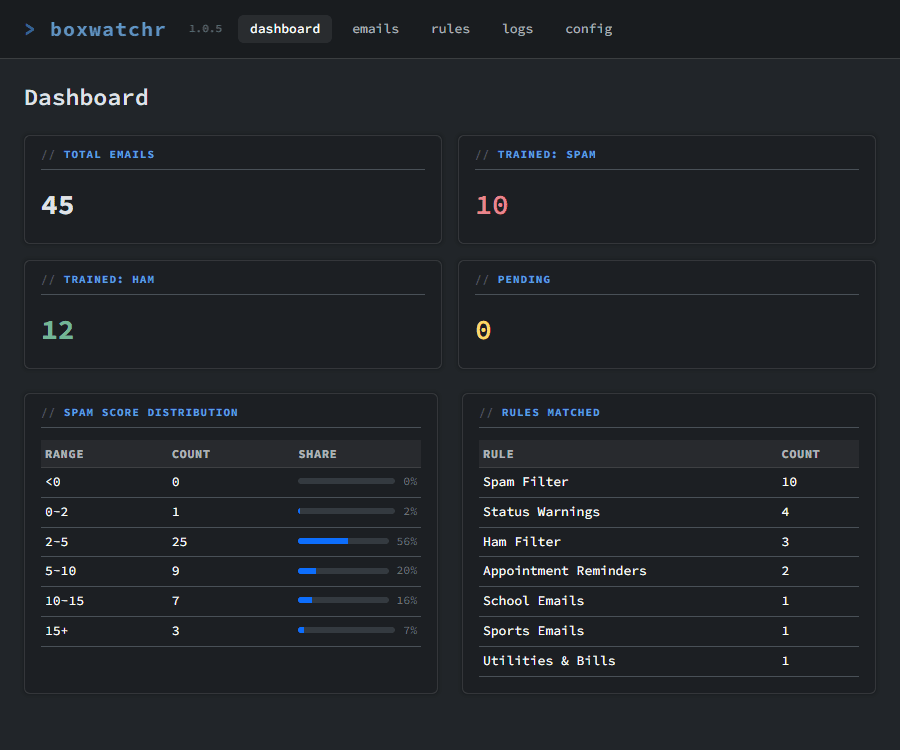
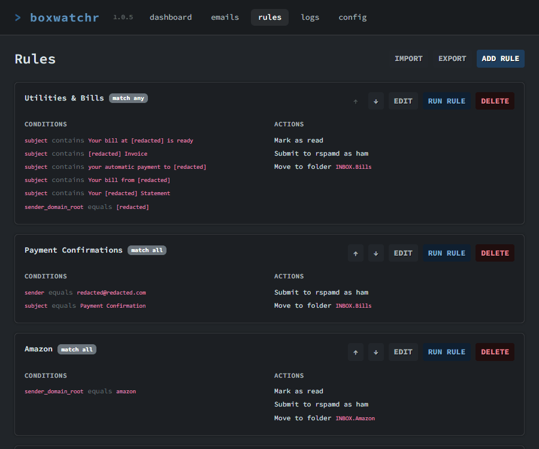
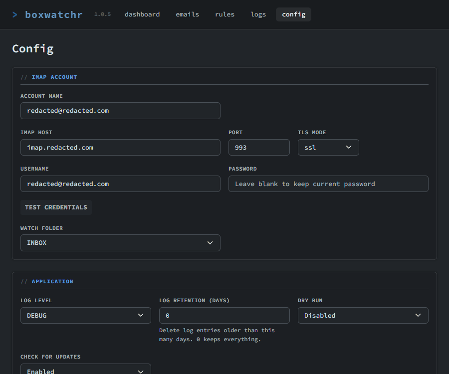

<p align="center"></p>

# > boxwatchr

A self-hosted email filtering daemon that watches your IMAP mailbox, scores every incoming message with a spam engine, runs it through your custom rules, and takes action automatically. No cloud, no subscriptions, just your server doing exactly what you tell it to.

---

## What it does

boxwatchr connects to your email account over IMAP, watches your inbox in real-time, and for every new message it:

1. Scores the email with rspamd and gets back a numeric spam score
2. Runs the email through your custom rules in order, and the first rule that matches wins
3. Takes action: move it, mark it read, flag it, submit it for spam training, whatever you told it to do
4. Logs everything to a SQLite database and shows you a dashboard of what happened

Think of it like email filters, but with a spam engine backing up every decision and a full history of everything that happened to every message.

---

## Features

- Real-time inbox monitoring via IMAP IDLE, with polling fallback if your server doesn't support it
- Spam scoring with rspamd, including DNS blocklists and Bayesian learning
- Bayesian spam training that gets smarter the more you use it
- Rule engine with conditions on sender, subject, domain, attachments, spam score, and more
- Dashboard with stats, spam score histogram, and rule match counts
- Full email log with per-message action history
- Dry run mode so you can see what boxwatchr would do before letting it act for real
- Rule changes take effect immediately without a restart
- Completely self-hosted, nothing leaves your server

---

## Screenshots

<a href="images/screenshots/02-dashboard.png"></a>

<a href="images/screenshots/05-rules.png"></a>

<a href="images/screenshots/11-config.png"></a>

[More screenshots...](/images/screenshots/)

---

## What you need

- Docker and Docker Compose installed on your server
- An email account that supports IMAP (Fastmail, Purelymail, Mailbox.org, your own mail server, pretty much anything)

That's it. Python, Redis, rspamd, and the DNS resolver are all bundled in the image. You don't need to install anything else.

---

## Getting started

boxwatchr needs two persistent directories on your host: one for config and one for data. Create them wherever you want to store them:

```
mkdir -p boxwatchr/config boxwatchr/data
```

### Option 1: Docker run

```
docker run -d \
  --name boxwatchr \
  --restart on-failure \
  -p 8143:8143 \
  -p 11334:11334 \
  -v /path/to/config:/app/config \
  -v /path/to/data:/app/data \
  -e PUID=1000 \
  -e PGID=1000 \
  -e TZ=America/New_York \
  ghcr.io/nulcraft/boxwatchr:latest
```

Replace `/path/to/config` and `/path/to/data` with absolute paths on your server. Docker run does not support relative paths. The `-e` flags are optional; skip them to use the defaults. If you prefer to use an env file instead of individual `-e` flags, add `--env-file /path/to/config/.env` before the image name.

### Option 2: Docker Compose

Create `docker-compose.yml` in your `boxwatchr` folder:

```yaml
services:
  boxwatchr:
    image: ghcr.io/nulcraft/boxwatchr:latest
    container_name: boxwatchr
    restart: on-failure
    ports:
      - "8143:8143"
      - "11334:11334"
    volumes:
      - ./config:/app/config
      - ./data:/app/data
    env_file:
      - path: ./config/.env
        required: false
```

Optionally create `config/.env` to configure environment variables (see the reference below), then start it:

```
docker compose up -d
```

### After starting

The first startup takes 15-30 seconds for rspamd and the DNS resolver to initialize. Then open:

```
http://your-server-ip:8143
```

You'll land directly on the setup wizard.

---

## Running on Unraid, Portainer, Synology, or other Docker GUIs

Skip the `.env` file entirely if your platform manages containers through a GUI. Configure the container with these settings and set environment variables directly through your platform's interface instead.

Image: `ghcr.io/nulcraft/boxwatchr:latest`

Volumes:
| Container path | Purpose |
|---|---|
| `/app/config` | Configuration storage |
| `/app/data` | Database and Bayesian data |

Ports:
| Host port | Container port | Purpose |
|---|---|---|
| `8143` | `8143` | boxwatchr web dashboard |
| `11334` | `11334` | rspamd web interface (optional) |

If you assign the container its own IP address, which is common on Unraid when using a bridge or macvlan network, port mappings are bypassed entirely. Access the container directly on its IP:

- Dashboard: `http://container-ip:8143`
- rspamd: `http://container-ip:11334`

---

## First-time setup

The setup wizard walks you through everything the first time. You only need to do this once.

Fill in your IMAP credentials, then click Test Credentials. If the connection succeeds, a dropdown appears letting you pick which folder to watch. This is usually `INBOX`.

Log level controls how much detail shows up in the system logs. `INFO` is the right choice for most people. `DEBUG` is very noisy, so only enable it when you are trying to track down a specific problem.

Log retention controls how many days of log entries to keep. Set it to `0` to keep everything forever, or a number like `7` to automatically clean up entries older than a week. The logs table can grow very large on a busy mailbox, so it is worth setting a retention period.

Leave dry run on for now. It is covered in detail below, but the short version is that boxwatchr will run your rules and tell you what it would have done without actually touching any emails.

Web password is optional, but recommended if the dashboard is reachable from outside your network.

Click Save, then restart the container. boxwatchr will start monitoring your mailbox on the next boot.

---

## Rules

Rules are the heart of boxwatchr. Each rule has a name, a match mode (all conditions or any condition), one or more conditions, and one or more actions.

Rules are evaluated in order, top to bottom. The first rule that matches an email wins and processing stops there. You can create, edit, reorder, and delete rules from the Rules page. Changes take effect immediately without a restart.

Note: Plans to support and/or operations are on the roadmap and I'd like to include them in the future. However, as of right now, first rule match wins.

---

### Conditions

Each condition has three parts: a field, an operator, and a value.

#### Sender fields

For the following examples, assume the sender address is `newsletter@mail.newsletter.example.com`.

| Label | Field | What it matches | Example |
|---|---|---|---|
| Sender: full address | `sender` | The entire address | `newsletter@mail.newsletter.example.com` |
| Sender: username | `sender_local` | Everything before the @ | `newsletter` |
| Sender: full domain | `sender_domain` | Everything after the @ | `mail.newsletter.example.com` |
| Sender: subdomain + domain | `sender_domain_name` | Subdomain and domain, no TLD | `mail.newsletter.example` |
| Sender: domain (no subdomain) | `sender_domain_root` | Domain only, no subdomain or TLD | `example` |
| Sender: TLD | `sender_domain_tld` | Top-level domain only | `com` |

The same six options exist for the recipient address, using `recipient` instead of `sender` in the dropdown.

#### Message fields

| Label | Field | What it matches |
|---|---|---|
| Subject | `subject` | The email subject line |
| Raw headers | `raw_headers` | All raw email headers, useful for things like `List-ID` or `X-Mailer` |

#### Attachment fields

| Label | Field | What it matches |
|---|---|---|
| Attachment: file name | `attachment_name` | The full filename, e.g. `invoice.pdf` |
| Attachment: extension | `attachment_extension` | Just the extension, e.g. `pdf` or `exe` |
| Attachment: content type | `attachment_content_type` | The MIME type, e.g. `application/pdf` |

#### Spam score

| Label | Field | What it matches |
|---|---|---|
| rspamd score | `rspamd_score` | The numeric spam score from rspamd |

---

### Operators

For text fields:

| Label | Operator |
|---|---|
| equals | `equals` |
| does not equal | `not_equals` |
| contains | `contains` |
| does not contain | `not_contains` |
| is empty | `is_empty` |

For rspamd score:

| Label | Operator |
|---|---|
| greater than | `greater_than` |
| less than | `less_than` |
| greater than or equal | `greater_than_or_equal` |
| less than or equal | `less_than_or_equal` |

A note on text matching: the `sender_local`, `sender_domain_name`, `sender_domain_root`, and their `recipient_*` equivalents all strip non-alphanumeric characters before comparing. This means `no.reply` and `noreply` both match if you search for `noreply`. It is intentional and helps you catch senders whose addresses use dots or dashes inconsistently.

---

### Actions

| Label | Type | What it does |
|---|---|---|
| Move to folder | `move` | Moves the email to the specified folder |
| Mark as read | `mark_read` | Marks the email as read |
| Mark as unread | `mark_unread` | Marks the email as unread |
| Flag message | `flag` | Flags or stars the email |
| Remove flag | `unflag` | Removes the flag or star |
| Submit as spam | `learn_spam` | Submits the email to rspamd for spam training |
| Submit as ham | `learn_ham` | Submits the email to rspamd as a legitimate message |

Move is a terminal action. Once an email is moved, processing stops. You can combine it with other actions in the same rule and they will all run before the move happens. To be safe, create the move action at the very end of your actions list.

---

### Running a rule manually

Each rule has a Run button on the Rules page. This applies that rule to all emails currently in your watched folder that are also in the database. It is a good way to test a new rule against your existing mail or to catch up on messages that arrived before boxwatchr was running.

---

## Dry run mode

When dry run is enabled, boxwatchr still monitors your inbox in real time and still evaluates every email against your rules, but it does not move, mark, flag, or submit anything for training. It logs exactly what it would have done so you can review it in the dashboard.

This is how you should start. Run it in dry run mode for a day or two, watch the Emails page, and verify that your rules are matching what you expect. Once you are satisfied, turn dry run off in Config.

Recommended first-run workflow:

1. Start the container. boxwatchr connects to your inbox, scans all existing messages, scores them, and logs them to the database. No rules exist yet, so everything logs as "No rule matched."
2. Create your rules on the Rules page.
3. Click Run on each rule in order from top to bottom. Each run evaluates that rule against every email in your watched folder and writes a `[DRY RUN]` note showing what would have happened. Run them in order because that is how they run in production.
4. Check the Emails page and review the notes column. If something does not look right, set the log level to DEBUG in Config and check the Logs page for the detailed condition trace on that email.
5. Adjust your rules and repeat until you are happy with the results.
6. Disable dry run in Config.

---

## Spam scoring

Every email that comes through gets scored by rspamd. The score shows up in the Emails list and on the detail page for each email. Higher means more likely to be spam. rspamd checks DNS blocklists, your Bayesian filter, headers, URLs, and more.

One important thing to know: boxwatchr does not use any spam headers that may already exist in the email, such as `X-Spam-Score` or anything your mail provider added before delivery. Every message is scored fresh by the rspamd instance running inside the container, independent of what any upstream server decided.

You do not need to configure rspamd directly. It runs inside the container and boxwatchr handles talking to it. You control what to do with the score through your rules, usually something like "if score is above 6, move it to spam."

On a fresh install, rspamd's Bayesian database is completely empty and untrained. This means the spam score relies almost entirely on DNS blocklists and rule-based checks, which can produce a lot of false positives depending on your mail. Before building rules that act on spam scores, it is worth spending time on the Training page to teach rspamd what is and is not spam for your specific mailbox. The more you train it, the more accurate the scores become.

### Bayesian training

The spam engine gets smarter when you train it. Add a `learn_spam` or `learn_ham` action to a rule and every email that matches it automatically gets submitted for training. The Training page lets you submit an entire folder at once by selecting a folder, choosing spam or ham, and submitting. Bayesian data is stored at `data/redis/` and persists across container restarts.

---

## Dashboard pages

The dashboard page shows aggregate stats: total emails processed, how many were trained as spam or ham, pending emails, a histogram of spam scores across all your mail, and a table showing how often each rule has matched.

The emails page is a full list of every email that came through, newest first. You can see the sender, subject, date, spam score, which rule matched, and what action was taken. Click any email to see the full detail page, which includes all headers, attachments, the full action history, and the log entries tied to that specific message.

The rules page is where you create, edit, delete, and reorder your rules.

The training page is where you bulk-train rspamd's Bayesian filter. Select a folder from your mailbox, choose spam or ham, and submit. boxwatchr connects to your IMAP account, fetches every message in that folder, and submits each one to rspamd while streaming progress back to you in real time. This is especially important on a fresh install when the Bayesian database is empty and spam scores are unreliable.

The logs page shows system logs, newest first, filterable by level and date range. Check here first if something is not behaving the way you expect.

The config page has all your account and application settings. Changes take effect immediately. If you change your IMAP credentials or watch folder, the connection reconnects automatically. If you change your web password, you are logged out immediately.

---

## Environment variables reference

These go in `config/.env` and control container-level behavior. Everything else is configured through the web dashboard.

| Variable | Default | Description |
|---|---|---|
| `PUID` | `99` | User ID to run as inside the container. Match this to your host user to avoid permission issues on mounted volumes. Run `id` on your server to find your value. |
| `PGID` | `100` | Group ID to run as inside the container. |
| `TZ` | `UTC` | Timezone used for log timestamps. Logs are stored in UTC and converted at display time, so you can change this at any time without affecting existing data. |
| `WEB_PORT` | `8143` | Internal port the web dashboard listens on. If you change this, update your Docker port mapping to match. |
| `RSPAMD_PASSWORD` | *(random)* | Password for the rspamd web interface on port 11334. A random password is generated at every startup if not set. |
| `SECURE_COOKIES` | `false` | Set to `true` if you are running boxwatchr behind an HTTPS reverse proxy. Marks the session cookie as `Secure` so it is only sent over encrypted connections. Leave unset for plain HTTP deployments. |

---

## Ports reference

| Port | What it is |
|---|---|
| `8143` | boxwatchr web dashboard (configurable via `WEB_PORT`) |
| `11334` | rspamd web interface (optional, password protected) |

---

## rspamd web interface

The rspamd controller is exposed on port 11334. You do not need it to use boxwatchr, but it is available if you want to dig into rspamd directly.

If you set `RSPAMD_PASSWORD` in your `.env`, use that to log in. If you did not set one, boxwatchr generated a random password at startup and logged it to the container output. Run this to find it:

```
docker compose logs boxwatchr | grep "rspamd web interface"
```

The password changes every restart unless you set one in your `.env`. boxwatchr still talks to rspamd internally either way.

---

## Data persistence

`config/` contains your `.env` file. You can also create `rspamd/local.d/` inside it and place `.conf` files there to override rspamd defaults. No additional overrides have been tested with boxwatchr, and incorrect rspamd configuration can affect scoring or cause rspamd to fail at startup, so proceed carefully.

`data/` contains the SQLite database (`boxwatchr.db`) and Redis Bayesian data (`redis/`). Your rules and account settings are stored in the database alongside your email history.

Back these up. The database has your entire email processing history and the Redis data has your Bayesian training. Losing them means starting from scratch.

---

## Security

boxwatchr stores your IMAP password encrypted in the database. The encryption key lives at `data/secret.key` on your server. Anyone with full access to your server could theoretically recover it, so use this on a server you control and trust.

The rspamd HTTP connection is plain HTTP on localhost. There is no need for TLS when both services are running on the same machine.

### Reverse proxy

Running boxwatchr behind a reverse proxy is strongly recommended if your dashboard is reachable from outside your home network. It lets you serve the dashboard over HTTPS with a real certificate, use your own domain, and add an extra authentication layer on top of the built-in web password.

Popular options include Nginx Proxy Manager, Caddy, Traefik, and nginx. Example configurations for nginx and Apache are in the `reverse-proxy/` directory of this repository. They cover SSL, OCSP stapling, security headers, IP-based access control, optional basic auth, and sub-path proxying for the rspamd interface at `/rspamd/`.

---

## Troubleshooting

- **The dashboard won't load after startup:**
  - Give it a minute. rspamd and the DNS resolver need time to initialize on first boot. Follow `docker compose logs boxwatchr -f` to see what's happening in real time.
- **The IMAP test connection fails:**
  - Double-check the host, port, and TLS mode. A lot of connection issues come from choosing the wrong port when it pertains to SSL/starttls.
- **Emails aren't being processed:**
  - Check the Logs page first. Something is almost certainly logged there. Common causes are dry run being enabled, no rules matching (if the email shows up in the Emails page, boxwatchr saw it, and a blank matched rule column just means nothing matched it), or the IMAP connection dropping.
- **The spam score is always 0.0:**
  - rspamd is not running or the DNS resolver is not working. Check `docker compose logs boxwatchr` for health check failures. rspamd needs working DNS to query blocklists, which is why boxwatchr includes its own internal resolver.
- **You've lost your web password:**
  - Stop the container, open `data/boxwatchr.db` with any SQLite tool, and delete the `web_password` row from the `config` table. With no password set, the dashboard is accessible without logging in.
- **Moved emails from another folder and some were not processed:**
  - When using IMAP IDLE, boxwatchr detects new messages when the server sends a notification. If you move a batch of emails at once, the notification can fire before all of them have landed. Messages that arrive after the check completes will be caught by the next periodic rescan.
